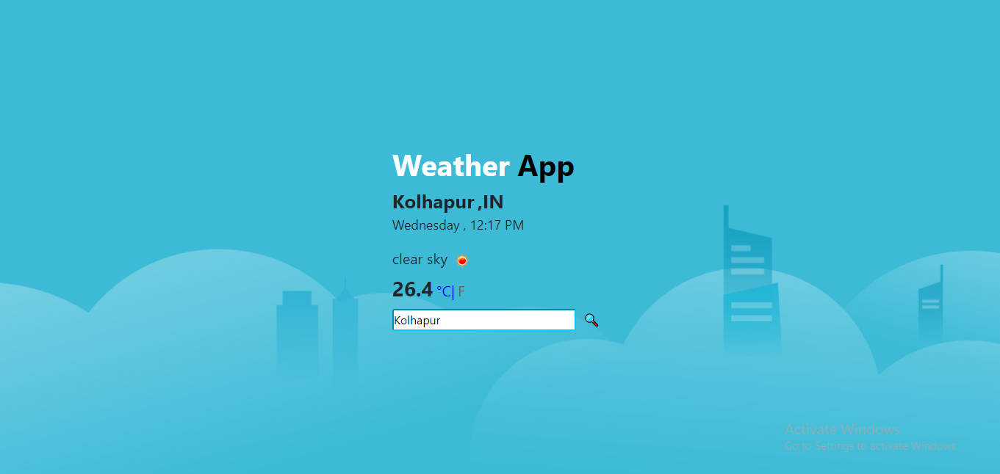

# LiveWeather-App-Using-API

This is Online Weather App which shows real-time weather of specified city and its temperature in both celsius and fahrenheit. It ask to user for allowing access to location and then display its weather. 

## Application Name

 WeatherApp

## Technology Used:

HTML, CSS, JavaScript.

## Image:

## Visit:
[WeatherApp](https://aadeshnichite.github.io/LiveWeather-App-Using-API/)
